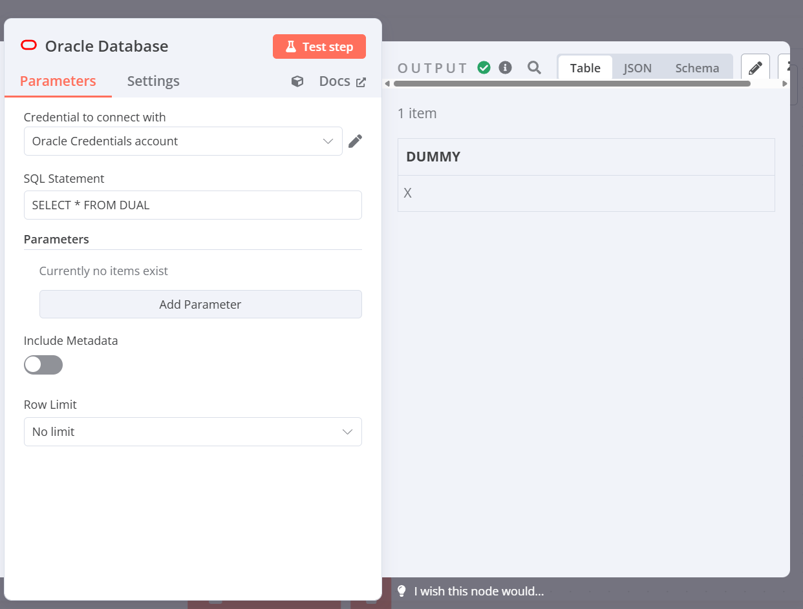

# **n8n Oracle Query Node**

This is a **custom node** for [n8n](https://n8n.io/) that allows executing **parameterized queries** on **Oracle Database**, providing more flexibility and security.



## **📌 Features**

- **Run SQL queries** on an Oracle database within n8n workflows.
- **Use parameters** to prevent SQL injection and improve reusability.
- **Optionally include metadata** in query results.
- **Support for `IN` statements** by dynamically expanding values.

---

## **📥 Installation**

To install this custom node in your n8n instance:

```sh
npm install n8n-oracle-query-node
```

Then, restart n8n to load the new node.

---

## **🛠 Usage**

### **Basic Query Example**

```sql
SELECT id, name FROM products WHERE category = :category
```

- **Parameter example:**
  - `category = "Electronics"`

### **Using Parameters**

You can pass dynamic values using **named parameters**:

### **Using IN Operator**

When using `IN`, the node expands values dynamically:

```sql
SELECT id, name FROM products WHERE category IN (:categories)
```

- **Parameter example:**
  - `categories = "Electronics, Home, Clothing"`

This is automatically converted into:

```sql
SELECT id, name FROM products WHERE category IN (:param1, :param2, :param3)
```

- Making it **safe** and preventing SQL injection.

---

## **⚙️ Configuration Options**

The node includes additional options to enhance performance and prevent heavy queries:

| **Option**           | **Description**                                                |
| -------------------- | -------------------------------------------------------------- |
| **Include Metadata** | Returns Oracle metadata (`metaData`) along with query results. |

---

## **📜 License**

This project is licensed under the [MIT License](LICENSE.md).
